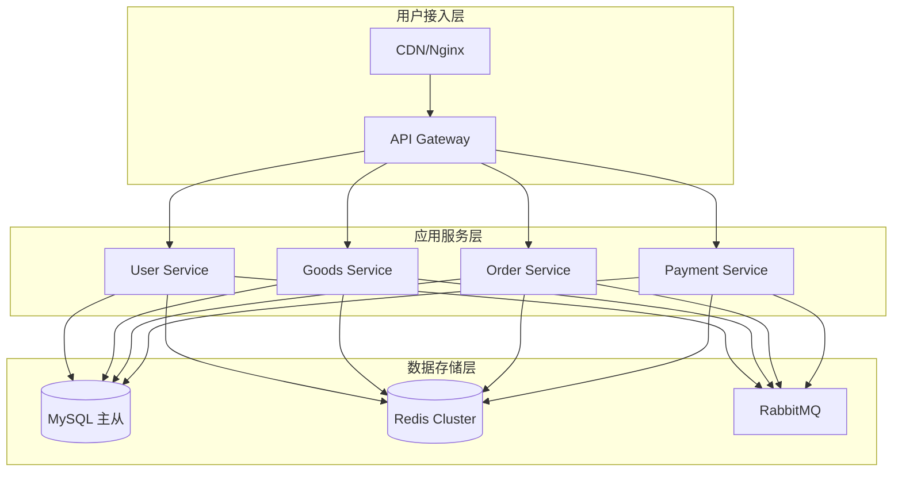

# Skill: architect (优化版)

## 基本信息
- **名称**: architect
- **版本**: 2.0.0
- **所属部门**: 研发部
- **优先级**: P0
- **能力等级**: ⭐⭐⭐⭐⭐ (5级 - 最高级)
- **复杂度**: complex
- **预估时间**: 30-60分钟

## 功能描述
架构设计主入口，根据需求自动生成架构方案和架构决策记录（ADR）。提供技术选型建议、系统架构图、模块划分等核心架构输出。支持与设计文档联动，自动更新相关设计文档。

## 前置条件

### 依赖 Skill
| Skill | 条件 | 说明 |
|-------|------|------|
| requirement-review | 需求评审完成 | 获取评审通过的需求数据 |

### 必需文档
| 文档 | 用途 | 可选 |
|------|------|------|
| 需求文档/PRD | 架构设计输入 | 否 |
| 现有架构文档 | 参考现有设计 | 是 |
| 技术约束文档 | 了解技术限制 | 是 |

### 权限要求
- `architecture:write` - 架构文档写入权限
- `repository:read` - 代码仓库读取权限

## 触发条件
- 命令触发: `/architect`
- 事件触发:
  - `requirement_review_passed` - 需求评审通过
  - `project_initiated` - 项目启动
  - `major_change_requested` - 重大变更请求
- 自然语言触发:
  - "设计系统架构"
  - "生成架构方案"
  - "技术选型建议"
  - "架构设计"

## 输入参数
| 参数名 | 类型 | 必填 | 默认值 | 描述 |
|--------|------|------|--------|------|
| requirements | string | 是 | - | 需求描述或PRD内容 |
| constraints | string | 否 | - | 技术约束条件 |
| preferences | string | 否 | - | 技术偏好（语言、框架等） |
| scale | string | 否 | medium | 系统规模：small / medium / large |
| template | string | 否 | default | 架构模板：default / microservice / monolith / serverless |
| output_dir | string | 否 | docs/architecture | 输出目录 |

## 执行流程

### 阶段1: 需求分析 (5-10分钟)
1. **解析需求文档** - 提取功能需求和非功能需求
2. **识别核心实体** - 从需求中提取业务实体
3. **分析约束条件** - 整理技术和业务约束
4. **评估系统规模** - 确定架构复杂度等级

### 阶段2: 技术选型 (10-15分钟)
1. **分析备选方案** - 列出可行的技术方案
2. **评估权衡** - 分析各方案的优劣
3. **生成推荐** - 输出技术选型建议
4. **记录决策** - 触发 ADR 记录重要决策

### 阶段3: 架构设计 (15-25分钟)
1. **设计系统架构** - 生成系统架构图
2. **模块划分** - 定义模块边界和职责
3. **接口设计** - 定义模块间接口
4. **数据设计** - 设计核心数据模型

### 阶段4: 文档输出 (5-10分钟)
1. **生成架构文档** - 输出完整架构设计文档
2. **更新关联文档** - 同步更新数据模型、领域设计等
3. **生成检查清单** - 输出架构评审检查清单

## 输出格式

### 架构设计文档
```markdown
# 系统架构设计

## 文档信息
- 版本: {version}
- 作者: AI Architect
- 创建时间: {timestamp}
- 关联需求: {requirement_id}

## 1. 架构概述
{系统整体架构描述}

## 2. 需求分析
### 2.1 功能需求
| 需求ID | 需求描述 | 优先级 |
|--------|----------|--------|
| {id} | {description} | {priority} |

### 2.2 非功能需求
| 类型 | 需求描述 | 指标 |
|------|----------|------|
| 性能 | {description} | {metric} |
| 可用性 | {description} | {metric} |

## 3. 技术选型
| 层级 | 技术选择 | 版本 | 选择理由 | 备选方案 |
|------|---------|------|---------|---------|
| 前端 | {tech} | {version} | {reason} | {alternatives} |
| 后端 | {tech} | {version} | {reason} | {alternatives} |
| 数据库 | {tech} | {version} | {reason} | {alternatives} |
| 缓存 | {tech} | {version} | {reason} | {alternatives} |

## 4. 系统架构图
```mermaid
{architecture_diagram}
```

## 5. 模块划分
### 5.1 核心模块
| 模块名 | 职责 | 依赖 | 接口数 |
|--------|------|------|--------|
| {module} | {responsibility} | {dependencies} | {count} |

### 5.2 公共模块
| 模块名 | 职责 | 使用方 |
|--------|------|--------|
| {module} | {responsibility} | {consumers} |

## 6. 接口设计
### 6.1 API设计原则
- {principle_1}
- {principle_2}

### 6.2 接口列表
| 模块 | 接口路径 | 方法 | 描述 |
|------|----------|------|------|
| {module} | {path} | {method} | {description} |

## 7. 数据设计
### 7.1 核心实体
| 实体 | 属性数 | 关联实体 | 存储 |
|------|--------|----------|------|
| {entity} | {count} | {relations} | {storage} |

### 7.2 数据流图
```mermaid
{data_flow_diagram}
```

## 8. 非功能性设计
### 8.1 性能设计
| 场景 | QPS目标 | 延迟目标 | 解决方案 |
|------|---------|----------|----------|
| {scenario} | {qps} | {latency} | {solution} |

### 8.2 安全设计
| 安全域 | 威胁 | 防护措施 |
|--------|------|----------|
| {domain} | {threat} | {measure} |

### 8.3 可扩展性设计
- 水平扩展策略: {strategy}
- 垂直扩展策略: {strategy}

## 9. 部署架构
### 9.1 部署拓扑
```mermaid
{deployment_diagram}
```

### 9.2 资源规划
| 组件 | 规格 | 数量 | 说明 |
|------|------|------|------|
| {component} | {spec} | {count} | {note} |

## 10. 风险与决策
### 10.1 风险评估
| 风险 | 概率 | 影响 | 缓解措施 |
|------|------|------|----------|
| {risk} | {probability} | {impact} | {mitigation} |

### 10.2 相关ADR
- ADR-{id}: {title}
- ADR-{id}: {title}

## 11. 备选方案
### 方案A vs 方案B
| 维度 | 方案A | 方案B | 选择 |
|------|-------|-------|------|
| 开发效率 | | | |
| 性能 | | | |
| 可维护性 | | | |
| 学习成本 | | | |

## 附录
- [详细数据模型](./data-model.md)
- [领域设计](./domain-design.md)
- [数据库设计](./database-design.md)
```

## 后置动作

### 触发 Skill
| Skill | 触发条件 | 传递参数 |
|-------|----------|----------|
| adr | 存在重大技术决策 | decision_context |
| scaffold | 架构设计完成且为新项目 | architecture_config |
| implement | 架构设计完成且为增量开发 | implementation_plan |

### 通知配置
| 事件 | 通知对象 | 通知方式 |
|------|----------|----------|
| 架构设计完成 | 技术负责人 | 邮件 + 站内信 |
| 发现设计冲突 | 产品 + 研发 | 站内信 |
| 需要评审 | 架构组 | 邮件 |

### 文档更新
| 文档 | 更新内容 | 更新时机 |
|------|----------|----------|
| 数据模型文档 | 实体定义和关系 | 架构确定后 |
| 领域设计文档 | 领域边界和服务 | 架构确定后 |
| 数据库设计文档 | 表结构设计 | 架构确定后 |

## 错误处理

### 错误类型
| 错误 | 处理方式 | 重试次数 | 超时 |
|------|----------|----------|------|
| 需求文档格式错误 | 请求用户修正 | 0 | - |
| 外部依赖超时 | 重试请求 | 3 | 30s |
| 模板渲染失败 | 使用默认模板 | 1 | - |
| 文档写入失败 | 重试写入 | 2 | 10s |

### 降级策略
- **降级 Skill**: scaffold
- **降级条件**: 架构设计失败或超时（>60分钟）
- **降级输出**: 使用默认脚手架模板生成项目结构

### 回滚支持
- **支持回滚**: 是
- **回滚策略**: 文档版本回退
- **检查点**: 每个阶段完成时创建

## 配置选项

### 模板配置
| 配置项 | 类型 | 默认值 | 说明 |
|--------|------|--------|------|
| template | string | default | 架构模板选择 |
| diagram_format | string | mermaid | 架构图格式 |
| output_language | string | zh-CN | 输出语言 |

### 规则配置
| 配置项 | 类型 | 默认值 | 说明 |
|--------|------|--------|------|
| require_adr | boolean | true | 是否自动生成ADR |
| min_alternatives | int | 2 | 最少备选方案数 |
| check_conflicts | boolean | true | 是否检查设计冲突 |

### 用户偏好
| 配置项 | 可选值 | 默认值 |
|--------|--------|--------|
| tech_stack | spring-boot, fastapi, gin, nest | spring-boot |
| architecture_style | microservice, monolith, serverless | microservice |
| database | mysql, postgresql, mongodb | mysql |

## 质量标准
- 技术选型合理性：提供至少2个备选方案
- 架构完整性：覆盖所有功能需求
- 可扩展性：支持3-5倍业务增长
- 文档完整性：包含架构图、模块图、接口定义
- 决策可追溯：重要决策关联ADR

## 使用示例

### 示例1: 电商系统架构设计
**输入**:
```yaml
requirements: |
  开发一个B2C电商平台，支持用户注册登录、商品浏览、购物车、
  订单管理、支付功能。预计日均PV 100万，高峰期QPS 5000。

constraints: |
  团队熟悉Java和MySQL，预算有限。

preferences: |
  语言：Java
  框架：Spring Boot

scale: large
template: microservice
```

**输出**:
```markdown
# 电商系统架构设计

## 文档信息
- 版本: 1.0.0
- 作者: AI Architect
- 创建时间: 2026-03-25T10:30:00Z
- 关联需求: REQ-2026-001

## 1. 架构概述
采用微服务架构，前后端分离，支持水平扩展。核心服务包括用户服务、
商品服务、订单服务、支付服务等。

## 2. 技术选型
| 层级 | 技术选择 | 版本 | 选择理由 | 备选方案 |
|------|---------|------|---------|---------|
| 前端 | Vue 3 + Vite | 3.x | 团队熟悉，生态完善，性能优秀 | React 18 |
| 后端 | Spring Boot | 3.2.x | Java生态，团队熟悉，成熟稳定 | Quarkus |
| 数据库 | MySQL | 8.0 | 关系型数据库，团队熟悉，成本低 | PostgreSQL |
| 缓存 | Redis | 7.x | 高性能缓存，支持分布式 | Memcached |
| 消息队列 | RabbitMQ | 3.12 | 轻量级，成本低，满足当前需求 | Kafka |
| 网关 | Spring Cloud Gateway | 4.x | 统一入口，限流熔断 | Kong |

## 3. 系统架构图


## 4. 模块划分
### 4.1 核心服务
| 模块名 | 职责 | 依赖 | 接口数 |
|--------|------|------|--------|
| user-service | 用户注册、登录、权限管理 | Redis, MySQL | 15 |
| goods-service | 商品管理、分类、搜索 | Redis, MySQL, ES | 20 |
| order-service | 订单创建、状态管理 | MySQL, MQ | 18 |
| payment-service | 支付对接、退款 | MySQL, MQ | 12 |

...
```

### 示例2: 快速原型架构
**输入**:
```yaml
requirements: "开发一个任务管理工具，支持任务的CRUD和团队协作"
scale: small
template: monolith
```

**输出**: (简化的单体架构设计文档)

## 依赖工具
- **Read** - 读取需求文档和现有架构文档
- **Write** - 输出架构设计文档
- **Edit** - 更新关联设计文档
- **WebSearch** - 查询技术最佳实践
- **Glob** - 查找项目现有结构
- **Bash** - 执行架构验证命令

## 注意事项
- 架构设计需要平衡理想方案和团队能力
- 过早优化是万恶之源，优先保证MVP可用
- 架构文档需要持续更新维护
- 重大架构决策必须记录ADR
- 考虑成本约束和运维复杂度
- 新项目建议使用脚手架模板快速启动

## 更新历史
| 版本 | 日期 | 变更内容 |
|------|------|----------|
| 2.0.0 | 2026-03-25 | 增加协作关系、错误处理、配置化支持 |
| 1.0.0 | 2026-03-18 | 初始版本 |