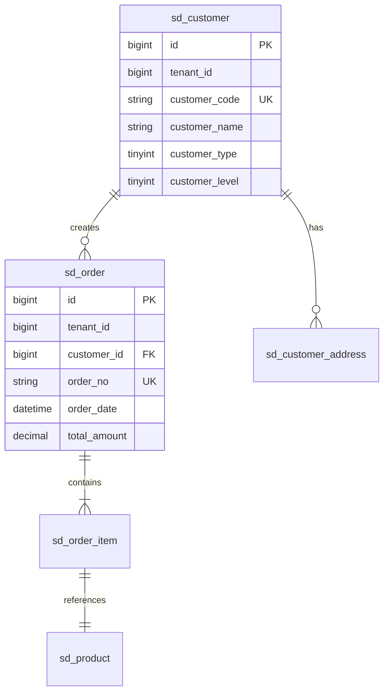

# db-designer

## 基本信息
| 属性 | 值 |
|------|------|
| 名称 | db-designer |
| 版本 | 1.0.0 |
| 部门 | 研发部 |
| 优先级 | P0 |
| 复杂度 | high |
| 预估时间 | 20-40min |

## 描述
根据PRD和业务需求，自动生成数据库设计文档，包括：
- 表结构设计（CREATE TABLE语句）
- 索引设计（主键、唯一索引、普通索引）
- ER图描述（ASCII/Mermaid格式）
- 多租户支持（tenant_id字段）
- 数据字典
- DDL脚本

## 触发条件

### 命令触发
```
/db-designer
```

### 事件触发
| 事件 | 条件 |
|------|------|
| prd_approved | PRD文档审核通过 |
| architecture_defined | 系统架构设计完成 |
| contract_signed | 开发契约签署 |

### 自然语言触发
| 关键词 | 示例 |
|--------|------|
| 设计数据库 | "请为销售管理模块设计数据库" |
| 生成表结构 | "生成客户管理的表结构" |
| 创建数据模型 | "创建销售订单的数据模型" |

## 输入参数

| 参数名 | 类型 | 必填 | 默认值 | 描述 |
|--------|------|------|--------|------|
| prd_file | string | 是 | - | PRD文档路径 |
| existing_tables | array | 否 | [] | 已有表结构（增量设计） |
| tenant_mode | string | 否 | shared_db | 多租户模式：shared_db/separate_db/hybrid |
| naming_convention | object | 否 | 见默认配置 | 命名规范配置 |
| module_code | string | 是 | - | 模块编码（如sd、wm、pp） |

### 默认命名规范配置
```yaml
naming_convention:
  table_prefix: "{module_code}_"
  table_case: snake_case
  column_case: snake_case
  index_prefix:
    primary: "PRIMARY"
    unique: "uk_{table}_{column}"
    normal: "idx_{table}_{column}"
```

## 输出产物

| 产物 | 路径 | 类型 | 描述 |
|------|------|------|------|
| 数据库设计文档 | 研发/数据库设计/DB-{module}.md | document | 完整设计文档 |
| DDL脚本 | 研发/数据库设计/sql/{module}_create.sql | script | 可执行的DDL |
| ER图 | 研发/数据库设计/diagrams/{module}_er.md | diagram | ER关系图 |
| 数据字典 | 研发/数据库设计/dict/{module}_dict.md | document | 字段说明字典 |

## 执行流程

### Phase 1: 需求分析（5min）
```
1. 解析PRD提取实体和关系
   - 识别核心业务实体（客户、订单、产品等）
   - 分析实体间关系（一对多、多对多）
   - 确定实体属性列表

2. 分析数据流和依赖关系
   - 上游依赖表（基础数据表）
   - 下游关联表（关联业务表）
   - 数据流向图

3. 确定设计范围
   - 新建表清单
   - 修改表清单（如有existing_tables）
   - 外键关系清单
```

### Phase 2: 实体设计（10min）
```
1. 设计实体属性
   - 业务属性（从PRD提取）
   - 系统属性（审计字段）
   - 关联属性（外键）

2. 定义主键策略
   - 默认: BIGINT AUTO_INCREMENT
   - 可选: 雪花算法（分布式场景）
   - 复合主键（特殊场景）

3. 设置外键关系
   - 一对多关系（parent_id）
   - 多对多关系（中间表）
   - 自引用关系（tree结构）

4. 添加审计字段（所有表必须）
   - created_by VARCHAR(50)
   - created_time DATETIME
   - updated_by VARCHAR(50)
   - updated_time DATETIME
   - deleted TINYINT DEFAULT 0
```

### Phase 3: 多租户设计（5min）
```
1. 添加tenant_id字段
   - 类型: BIGINT NOT NULL
   - 位置: id之后第二个字段
   - 约束: 包含在所有唯一索引中

2. 设计租户隔离策略
   - shared_db模式: tenant_id + 唯一索引隔离
   - separate_db模式: 动态数据源切换
   - hybrid模式: 核心表共享，业务表隔离

3. 配置索引策略
   - tenant_id作为联合索引第一列
   - 所有查询条件包含tenant_id
```

### Phase 4: 索引设计（5min）
```
1. 分析查询场景（从PRD/UserStory提取）
   - 列表查询（分页、排序、过滤）
   - 详情查询（主键查询）
   - 关联查询（外键查询）
   - 搜索查询（模糊匹配）

2. 设计索引类型
   | 索引类型 | 适用场景 | 设计规则 |
   |----------|----------|----------|
   | 主键索引 | 唯一标识 | PRIMARY KEY (id) |
   | 唯一索引 | 业务唯一键 | UNIQUE KEY uk_{table}_{col} (tenant_id, {col}) |
   | 普通索引 | 查询优化 | KEY idx_{table}_{col} (tenant_id, {col}) |
   | 联合索引 | 组合查询 | KEY idx_{table}_{cols} (tenant_id, col1, col2) |

3. 索引设计原则
   - 最左匹配原则
   - 覆盖索引优化
   - 避免冗余索引
```

### Phase 5: 文档生成（10min）
```
1. 生成表结构文档
   - 文档头部信息（编号、版本、日期）
   - 设计概述（原则、规范）
   - 表结构详情（CREATE TABLE语句）
   - 索引设计说明

2. 生成ER图
   - Mermaid格式（推荐）
   - ASCII格式（备用）
   - 标注关系类型

3. 生成DDL脚本
   - 建表语句
   - 索引语句
   - 初始化数据（如有）

4. 生成数据字典
   - 表名对照表
   - 字段名对照表
   - 状态值说明
```

## 质量标准

### 必须满足
| 标准 | 描述 | 验证方式 |
|------|------|----------|
| 多租户支持 | 所有业务表包含 tenant_id 字段 | 检查所有CREATE TABLE语句 |
| 审计字段完整 | 包含 created_by, created_time, updated_by, updated_time, deleted | 字段检查 |
| 主键定义正确 | 使用 BIGINT 自增或雪花算法 | 类型检查 |
| 外键索引存在 | 所有外键字段建立索引 | 索引检查 |
| 状态字段注释 | 状态类字段必须有COMMENT说明值含义 | 注释检查 |
| 命名规范一致 | 表名和字段名遵循命名规范 | 格式检查 |
| 字符集统一 | CHARSET=utf8mb4, COLLATE=utf8mb4_unicode_ci | 配置检查 |

### 建议满足
| 标准 | 描述 |
|------|------|
| 字段长度合理 | VARCHAR长度根据业务需要设定，避免过大 |
| 数值精度正确 | DECIMAL精度根据金额/数量需要设定 |
| 默认值合理 | 合理设置DEFAULT值 |
| 索引命名清晰 | 索引名称体现用途 |

## 示例

### 输入
```yaml
prd_file: 产品/PRD/PRD-01-销售管理模块.md
module_code: sd
tenant_mode: shared_db
naming_convention:
  table_prefix: "sd_"
  table_case: snake_case
```

### 输出（部分示例）

#### 表结构文档
```sql
-- ============================================================
-- 表名: sd_customer (客户主数据表)
-- 描述: 管理客户基本信息，支持客户分层管理
-- ============================================================
CREATE TABLE `sd_customer` (
  `id` BIGINT NOT NULL AUTO_INCREMENT COMMENT '主键ID',
  `tenant_id` BIGINT NOT NULL COMMENT '租户ID',
  `customer_code` VARCHAR(32) NOT NULL COMMENT '客户编码',
  `customer_name` VARCHAR(200) NOT NULL COMMENT '客户名称',
  `customer_short_name` VARCHAR(100) DEFAULT NULL COMMENT '客户简称',
  `customer_type` TINYINT NOT NULL DEFAULT 1 COMMENT '客户类型:1-整车厂,2-一级供应商,3-经销商,4-零售商',
  `customer_level` TINYINT DEFAULT 3 COMMENT '客户等级:1-A级,2-B级,3-C级',
  `credit_limit` DECIMAL(18,2) DEFAULT 0.00 COMMENT '信用额度',
  `credit_used` DECIMAL(18,2) DEFAULT 0.00 COMMENT '已用信用额度',
  `status` TINYINT NOT NULL DEFAULT 1 COMMENT '状态:0-禁用,1-启用',
  `remark` VARCHAR(500) DEFAULT NULL COMMENT '备注',
  `created_by` VARCHAR(50) DEFAULT NULL COMMENT '创建人',
  `created_time` DATETIME NOT NULL DEFAULT CURRENT_TIMESTAMP COMMENT '创建时间',
  `updated_by` VARCHAR(50) DEFAULT NULL COMMENT '更新人',
  `updated_time` DATETIME DEFAULT NULL ON UPDATE CURRENT_TIMESTAMP COMMENT '更新时间',
  `deleted` TINYINT NOT NULL DEFAULT 0 COMMENT '删除标记:0-未删除,1-已删除',
  PRIMARY KEY (`id`),
  UNIQUE KEY `uk_sd_customer_code` (`tenant_id`, `customer_code`),
  KEY `idx_sd_customer_tenant` (`tenant_id`),
  KEY `idx_sd_customer_type` (`tenant_id`, `customer_type`),
  KEY `idx_sd_customer_level` (`tenant_id`, `customer_level`)
) ENGINE=InnoDB DEFAULT CHARSET=utf8mb4 COLLATE=utf8mb4_unicode_ci COMMENT='客户主数据表';
```

#### ER图（Mermaid格式）


## 错误处理

| 错误代码 | 错误描述 | 处理方式 |
|----------|----------|----------|
| DB001 | PRD文件不存在 | 返回错误，提示正确路径 |
| DB002 | 实体提取失败 | 分析PRD格式，提供修复建议 |
| DB003 | 表名冲突 | 检查existing_tables，建议修改命名 |
| DB004 | 外键循环依赖 | 检查关系设计，提供重构建议 |
| DB005 | 索引命名冲突 | 自动调整索引名称 |

## 与其他Skill的关系

### 上游依赖
| Skill | 依赖内容 |
|------|----------|
| requirement-analyzer | 功能需求清单 |
| user-story-generator | 业务场景描述 |
| architect | 技术选型、架构约束 |

### 下游输出
| Skill | 输出内容 |
|------|----------|
| api-designer | 表结构作为API实体基础 |
| entity-generator | 表结构生成Java实体类 |
| crud-generator | 表结构生成CRUD代码 |
| test-case-generator | 表结构生成测试数据 |