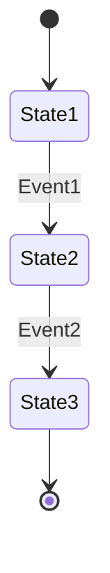
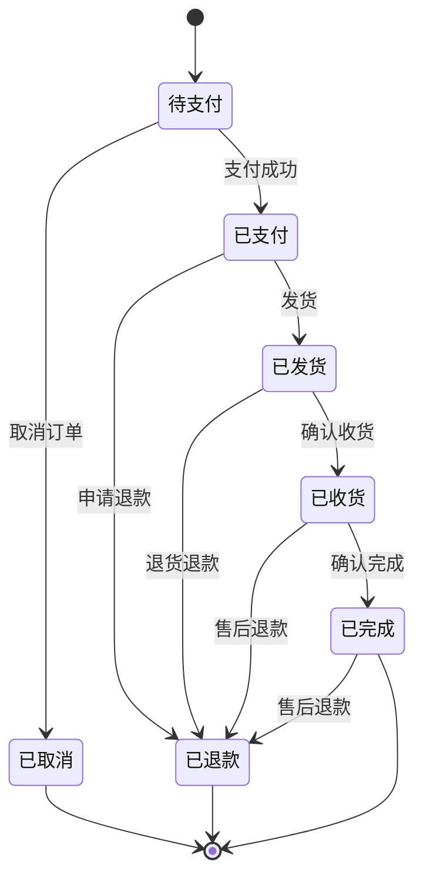

# Skill: state-machine-designer

## 基本信息
- **名称**: state-machine-designer
- **版本**: 1.0.0
- **所属部门**: 研发部
- **优先级**: P1

## 功能描述
根据业务需求设计状态机模型，包括状态定义、状态流转、触发事件、守卫条件、动作执行等。生成状态机图和状态转换表，支持代码生成。

## 触发条件
- 命令触发: `/state-machine-designer`
- 自然语言触发:
  - "设计状态机"
  - "设计状态流转"
  - "创建状态模型"
  - "分析业务状态"

## 输入参数
| 参数名 | 类型 | 必填 | 描述 |
|--------|------|------|------|
| business_context | string | 是 | 业务上下文描述 |
| entity_name | string | 是 | 实体名称 |
| initial_state | string | 否 | 初始状态 |

## 执行流程
1. **状态识别** - 识别业务中的所有状态
2. **事件识别** - 识别触发状态变更的事件
3. **转换分析** - 分析状态之间的转换关系
4. **守卫定义** - 定义状态转换的前置条件
5. **动作定义** - 定义状态转换时执行的动作
6. **闭环验证** - 验证状态机完整性
7. **文档输出** - 生成状态机文档

## 状态机要素

| 要素 | 说明 | 示例 |
|------|------|------|
| 状态(State) | 实体在某一时刻的状态 | 待支付、已支付、已发货 |
| 事件(Event) | 触发状态变更的操作 | 支付成功、发货、取消 |
| 转换(Transition) | 状态之间的变更路径 | 待支付 → 已支付 |
| 守卫(Guard) | 状态转换的前置条件 | 库存充足才能发货 |
| 动作(Action) | 状态转换时执行的操作 | 发送通知、更新库存 |
| 初始状态 | 实体创建时的默认状态 | 待支付 |
| 终态 | 流程结束的最终状态 | 已完成、已取消 |

## 输出格式

### 状态机设计文档
```markdown
# {实体名称}状态机设计文档

## 1. 状态机概述

| 项目 | 内容 |
|------|------|
| 实体名称 | {entity} |
| 状态数量 | {count} |
| 初始状态 | {initial} |
| 终态列表 | {terminals} |

## 2. 状态定义

| 状态值 | 状态名 | 说明 | 是否终态 |
|--------|--------|------|----------|
| 0 | {name} | {desc} | 否 |
| 1 | {name} | {desc} | 是 |

## 3. 状态流转图



## 4. 状态转换表

| 当前状态 | 目标状态 | 触发事件 | 守卫条件 | 执行动作 |
|----------|----------|----------|----------|----------|
| S1 | S2 | E1 | Guard1 | Action1 |

## 5. 事件定义

| 事件编码 | 事件名称 | 说明 | 触发方式 |
|----------|----------|------|----------|
| E1 | {name} | {desc} | 用户操作/系统自动 |

## 6. 守卫条件

| 守卫ID | 守卫名称 | 守卫逻辑 | 说明 |
|--------|----------|----------|------|
| G1 | {name} | {logic} | {desc} |

## 7. 动作定义

| 动作ID | 动作名称 | 动作逻辑 | 说明 |
|--------|----------|----------|------|
| A1 | {name} | {logic} | {desc} |

## 8. 代码实现示例

```java
// 状态机实现代码
```

## 9. 状态机验证

### 9.1 可达性验证
- 所有状态从初始状态可达
- 所有终态可到达

### 9.2 闭环验证
- 无死状态（无法离开的非终态）
- 无无限循环
```

## 质量标准
- 状态完整性：覆盖所有业务状态
- 流转闭环：无死状态
- 守卫完整：关键转换有条件保护
- 动作完整：状态变更的副作用已定义

## 使用示例

### 示例：设计订单状态机

**输入**:
```
业务场景：电商订单
状态：待支付、已支付、已发货、已收货、已完成、已取消、已退款
事件：支付、发货、收货、完成、取消、退款
```

**输出**:
```markdown
# 订单状态机设计文档

## 1. 状态机概述

| 项目 | 内容 |
|------|------|
| 实体名称 | 订单(Order) |
| 状态数量 | 7 |
| 初始状态 | 待支付 |
| 终态列表 | 已完成、已取消 |

## 2. 状态定义

| 状态值 | 状态名 | 英文名 | 说明 | 是否终态 |
|--------|--------|--------|------|----------|
| 0 | 待支付 | PENDING_PAYMENT | 订单已创建，等待支付 | 否 |
| 1 | 已支付 | PAID | 支付完成，等待发货 | 否 |
| 2 | 已发货 | SHIPPED | 已发货，等待收货 | 否 |
| 3 | 已收货 | RECEIVED | 已收货，等待确认完成 | 否 |
| 4 | 已完成 | COMPLETED | 订单完成 | 是 |
| 5 | 已取消 | CANCELLED | 订单已取消 | 是 |
| 6 | 已退款 | REFUNDED | 订单已退款 | 是 |

## 3. 状态流转图



## 4. 状态转换表

| 当前状态 | 目标状态 | 触发事件 | 守卫条件 | 执行动作 |
|----------|----------|----------|----------|----------|
| 待支付 | 已支付 | 支付成功 | 支付金额正确 | 发送支付成功通知 |
| 待支付 | 已取消 | 取消订单 | 订单未支付 | 释放库存 |
| 已支付 | 已发货 | 发货 | 库存充足 | 扣减库存、发送发货通知 |
| 已支付 | 已退款 | 申请退款 | 支付状态正常 | 创建退款单、退款 |
| 已发货 | 已收货 | 确认收货 | 物流已签收 | 发送收货确认通知 |
| 已发货 | 已退款 | 退货退款 | 货物已退回 | 创建退货单、退款 |
| 已收货 | 已完成 | 确认完成 | 无售后申请 | 发送完成通知、积分奖励 |
| 已收货 | 已退款 | 售后退款 | 在售后期内 | 创建售后单、退款 |
| 已完成 | 已退款 | 售后退款 | 在售后期内 | 创建售后单、退款 |

## 5. 事件定义

| 事件编码 | 事件名称 | 说明 | 触发方式 |
|----------|----------|------|----------|
| PAY_SUCCESS | 支付成功 | 用户完成支付 | 支付回调 |
| CANCEL | 取消订单 | 用户或系统取消订单 | 用户操作/超时自动 |
| SHIP | 发货 | 商家发货 | 商家操作 |
| RECEIVE | 确认收货 | 用户确认收货 | 用户操作/自动确认 |
| COMPLETE | 确认完成 | 用户确认订单完成 | 用户操作/自动确认 |
| REFUND | 退款 | 发起退款申请 | 用户操作 |

## 6. 守卫条件

| 守卫ID | 守卫名称 | 守卫逻辑 | 说明 |
|--------|----------|----------|------|
| G001 | 支付金额校验 | payAmount == orderAmount | 支付金额必须等于订单金额 |
| G002 | 库存充足校验 | stock >= orderQuantity | 发货前校验库存 |
| G003 | 售后期校验 | now - completeTime <= 30天 | 完成后30天内可售后 |
| G004 | 未支付校验 | status == PENDING_PAYMENT | 只有待支付状态可取消 |

## 7. 动作定义

| 动作ID | 动作名称 | 动作逻辑 | 说明 |
|--------|----------|----------|------|
| A001 | 发送支付成功通知 | sendNotification(userId, "支付成功") | 通知用户支付成功 |
| A002 | 释放库存 | releaseStock(skuId, quantity) | 取消订单时释放预留库存 |
| A003 | 扣减库存 | deductStock(skuId, quantity) | 发货时扣减实际库存 |
| A004 | 发送发货通知 | sendNotification(userId, "订单已发货") | 通知用户订单已发货 |
| A005 | 创建退款单 | createRefundOrder(orderId, amount) | 创建退款记录 |
| A006 | 执行退款 | executeRefund(refundId) | 调用支付渠道退款 |
| A007 | 积分奖励 | addPoints(userId, points) | 订单完成后奖励积分 |

## 8. 代码实现示例

### 8.1 状态枚举定义

```java
public enum OrderStatus {
    PENDING_PAYMENT(0, "待支付"),
    PAID(1, "已支付"),
    SHIPPED(2, "已发货"),
    RECEIVED(3, "已收货"),
    COMPLETED(4, "已完成"),
    CANCELLED(5, "已取消"),
    REFUNDED(6, "已退款");

    private final int code;
    private final String name;

    OrderStatus(int code, String name) {
        this.code = code;
        this.name = name;
    }

    public int getCode() { return code; }
    public String getName() { return name; }
}
```

### 8.2 状态机配置（Spring State Machine）

```java
@Configuration
@EnableStateMachineFactory
public class OrderStateMachineConfig extends StateMachineConfigurerAdapter<OrderStatus, OrderEvent> {

    @Override
    public void configure(StateMachineStateConfigurer<OrderStatus, OrderEvent> states) throws Exception {
        states
            .withStates()
            .initial(OrderStatus.PENDING_PAYMENT)
            .state(OrderStatus.PAID)
            .state(OrderStatus.SHIPPED)
            .state(OrderStatus.RECEIVED)
            .end(OrderStatus.COMPLETED)
            .end(OrderStatus.CANCELLED)
            .end(OrderStatus.REFUNDED);
    }

    @Override
    public void configure(StateMachineTransitionConfigurer<OrderStatus, OrderEvent> transitions) throws Exception {
        transitions
            // 待支付 -> 已支付
            .withExternal()
                .source(OrderStatus.PENDING_PAYMENT).target(OrderStatus.PAID)
                .event(OrderEvent.PAY_SUCCESS)
                .guard(paymentAmountGuard())
                .action(sendPaymentSuccessNotification())
            .and()
            // 待支付 -> 已取消
            .withExternal()
                .source(OrderStatus.PENDING_PAYMENT).target(OrderStatus.CANCELLED)
                .event(OrderEvent.CANCEL)
                .action(releaseStockAction())
            .and()
            // 已支付 -> 已发货
            .withExternal()
                .source(OrderStatus.PAID).target(OrderStatus.SHIPPED)
                .event(OrderEvent.SHIP)
                .guard(stockAvailableGuard())
                .action(deductStockAction())
            .and()
            // 已发货 -> 已收货
            .withExternal()
                .source(OrderStatus.SHIPPED).target(OrderStatus.RECEIVED)
                .event(OrderEvent.RECEIVE)
            .and()
            // 已收货 -> 已完成
            .withExternal()
                .source(OrderStatus.RECEIVED).target(OrderStatus.COMPLETED)
                .event(OrderEvent.COMPLETE)
                .action(addPointsAction());
    }

    @Bean
    public Guard<OrderStatus, OrderEvent> paymentAmountGuard() {
        return context -> {
            Order order = context.getMessage().getHeaders().get("order", Order.class);
            BigDecimal payAmount = context.getMessage().getHeaders().get("payAmount", BigDecimal.class);
            return order.getAmount().compareTo(payAmount) == 0;
        };
    }

    @Bean
    public Guard<OrderStatus, OrderEvent> stockAvailableGuard() {
        return context -> {
            Order order = context.getMessage().getHeaders().get("order", Order.class);
            return stockService.checkStock(order.getSkuId(), order.getQuantity());
        };
    }

    @Bean
    public Action<OrderStatus, OrderEvent> sendPaymentSuccessNotification() {
        return context -> {
            Order order = context.getMessage().getHeaders().get("order", Order.class);
            notificationService.send(order.getUserId(), "支付成功");
        };
    }
}
```

### 8.3 状态机服务

```java
@Service
public class OrderStateMachineService {

    @Autowired
    private StateMachineFactory<OrderStatus, OrderEvent> stateMachineFactory;

    public boolean changeStatus(Order order, OrderEvent event) {
        StateMachine<OrderStatus, OrderEvent> sm = stateMachineFactory.getStateMachine(order.getId().toString());
        
        Message<OrderEvent> message = MessageBuilder
            .withPayload(event)
            .setHeader("order", order)
            .build();

        sm.start();
        boolean accepted = sm.sendEvent(message);
        sm.stop();

        if (accepted) {
            order.setStatus(sm.getState().getId());
            orderRepository.save(order);
        }

        return accepted;
    }
}
```

## 9. 状态机验证

### 9.1 可达性验证
| 状态 | 从初始状态可达 | 到达终态路径 |
|------|----------------|--------------|
| 待支付 | ✓（初始状态） | 取消 → 已取消 |
| 已支付 | ✓（支付成功） | 退款 → 已退款 |
| 已发货 | ✓（发货） | 退款 → 已退款 |
| 已收货 | ✓（收货） | 完成 → 已完成 |
| 已完成 | ✓（完成） | 终态 |
| 已取消 | ✓（取消） | 终态 |
| 已退款 | ✓（退款） | 终态 |

### 9.2 闭环验证
- ✓ 无死状态：所有非终态都有转换路径
- ✓ 无无限循环：状态转换单向进行
- ✓ 所有终态可达：完成、取消、退款均可到达

### 9.3 异常场景处理
| 异常场景 | 处理方式 |
|----------|----------|
| 支付超时 | 系统自动取消订单（待支付状态超过30分钟） |
| 发货失败 | 状态回滚到已支付，记录失败原因 |
| 收货超时 | 系统自动确认收货（发货后7天） |
| 完成超时 | 系统自动确认完成（收货后15天） |
```

## 依赖工具
- Read - 读取需求文档
- Write - 输出状态机文档
- Grep - 搜索相关状态定义

## 注意事项
- 状态机设计需要业务方确认
- 注意处理异常状态转换
- 考虑并发场景下的状态一致性
- 状态变更需要记录日志便于追溯
- 终态设计要满足业务完整性