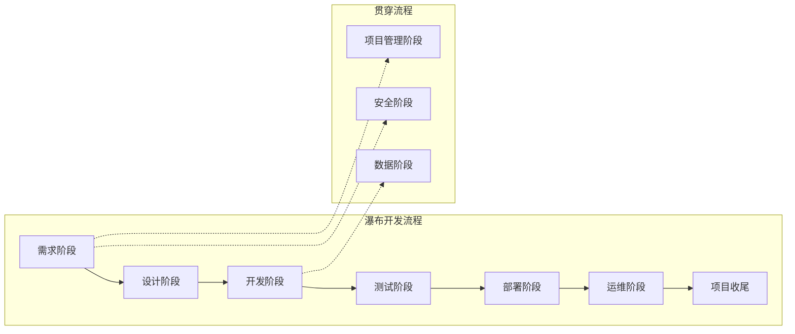

# 瀑布开发流程

## 概述

瀑布开发流程是一种传统的软件开发方法论，采用线性顺序执行的方式，每个阶段按固定顺序依次进行。适用于需求明确、变更较少、质量要求严格的项目。

## 流程全景图



```
┌─────────────────────────────────────────────────────────────────────────────┐
│                            瀑布开发流程全景图                                 │
├─────────────────────────────────────────────────────────────────────────────┤
│                                                                              │
│  ┌──────────┐   ┌──────────┐   ┌──────────┐   ┌──────────┐   ┌──────────┐ │
│  │ 需求阶段 │──▶│ 设计阶段 │──▶│ 开发阶段 │──▶│ 测试阶段 │──▶│ 部署阶段 │ │
│  └──────────┘   └──────────┘   └──────────┘   └──────────┘   └──────────┘ │
│        │              │              │              │              │        │
│        │              │              │              │              ▼        │
│        │              │              │              │        ┌──────────┐  │
│        │              │              │              │        │ 运维阶段 │  │
│        │              │              │              │        └──────────┘  │
│        │              │              │              │              │        │
│        │              │              │              │              ▼        │
│        │              │              │              │        ┌──────────┐  │
│        │              │              │              │        │ 项目收尾 │  │
│        │              │              │              │        └──────────┘  │
│        │              │              │              │              │        │
│        └──────────────┴──────────────┴──────────────┴──────────────┘        │
│                                                                              │
│  ┌──────────────────────────────────────────────────────────────────────┐   │
│  │                        贯穿全流程                                      │   │
│  │  ┌──────────┐              ┌──────────┐              ┌──────────┐    │   │
│  │  │ 安全阶段 │              │ 数据阶段 │              │ 项目管理 │    │   │
│  │  └──────────┘              └──────────┘              └──────────┘    │   │
│  └──────────────────────────────────────────────────────────────────────┘   │
│                                                                              │
└─────────────────────────────────────────────────────────────────────────────┘
```

## 阶段导航

| 阶段 | 目录 | 核心目标 | 关键产出 | 质量门控 |
|------|------|---------|---------|---------|
| 需求阶段 | [01-需求阶段](01-需求阶段/) | 明确需求范围 | PRD、用户故事 | Gate 1 |
| 设计阶段 | [02-设计阶段](02-设计阶段/) | 设计技术方案 | 架构设计、技术选型 | Gate 2 |
| 开发阶段 | [03-开发阶段](03-开发阶段/) | 实现功能代码 | 源代码、技术文档 | Gate 3 |
| 测试阶段 | [04-测试阶段](04-测试阶段/) | 验证质量 | 测试报告、缺陷修复 | Gate 4 |
| 部署阶段 | [05-部署阶段](05-部署阶段/) | 发布上线 | 部署包、运维手册 | Gate 5 |
| 运维阶段 | [06-运维阶段](06-运维阶段/) | 稳定运行 | 监控报表、故障处理 | - |
| 项目收尾 | [07-项目收尾阶段](07-项目收尾阶段/) | 总结归档 | 验收报告、复盘文档 | - |
| 安全阶段 | [08-安全阶段](08-安全阶段/) | 安全保障 | 安全方案、安全审计 | - |
| 数据阶段 | [09-数据阶段](09-数据阶段/) | 数据管理 | 数据方案、数据治理 | - |
| 项目管理 | [10-项目管理阶段](10-项目管理阶段/) | 项目管控 | 项目计划、进度报告 | - |

## 角色定义

### 与1.0角色模型对应

| 角色 | 瀑布流程职责 | 对应1.0角色 |
|------|-------------|------------|
| 项目经理 | 全流程管控、资源协调 | 项目管理部 |
| 产品经理 | 需求分析、产品规划 | 产品部 |
| 技术负责人 | 技术决策、架构设计 | 技术部 |
| 开发工程师 | 代码开发、技术实现 | 开发部 |
| 测试工程师 | 测试执行、质量保障 | 测试部 |
| 运维工程师 | 部署运维、系统稳定 | 运维部 |

### 角色层级结构

```
┌─────────────────────────────────────────────────────────────────────┐
│                        瀑布流程角色层级                              │
├─────────────────────────────────────────────────────────────────────┤
│                                                                      │
│                     ┌──────────────────┐                            │
│                     │   项目指导委员会   │                            │
│                     │   (决策层)        │                            │
│                     └────────┬─────────┘                            │
│                              │                                       │
│              ┌───────────────┼───────────────┐                      │
│              │               │               │                      │
│              ▼               ▼               ▼                      │
│     ┌──────────────┐ ┌──────────────┐ ┌──────────────┐              │
│     │   项目经理    │ │  产品经理    │ │  技术负责人   │              │
│     │  (管理层)    │ │  (管理层)    │ │  (管理层)    │              │
│     └──────────────┘ └──────────────┘ └──────────────┘              │
│                              │                                       │
│              ┌───────────────┼───────────────┐                      │
│              │               │               │                      │
│              ▼               ▼               ▼                      │
│     ┌──────────────┐ ┌──────────────┐ ┌──────────────┐              │
│     │  开发工程师   │ │  测试工程师   │ │  运维工程师   │              │
│     │  (执行层)    │ │  (执行层)    │ │  (执行层)    │              │
│     └──────────────┘ └──────────────┘ └──────────────┘              │
│                                                                      │
└─────────────────────────────────────────────────────────────────────┘
```

## 质量门控体系

瀑布流程通过5个关键质量门控确保各阶段产出质量：

| 门控 | 名称 | 检查阶段 | 核心检查项 |
|------|------|---------|-----------|
| Gate 1 | 需求就绪 | 需求阶段结束 | PRD完整性、用户故事质量、验收标准 |
| Gate 2 | 设计就绪 | 设计阶段结束 | 架构设计评审、技术选型决策、接口设计 |
| Gate 3 | 开发就绪 | 开发阶段结束 | 代码审查、单元测试、代码规范、安全扫描 |
| Gate 4 | 测试就绪 | 测试阶段结束 | 功能测试、性能测试、缺陷修复、UAT验收 |
| Gate 5 | 发布就绪 | 部署阶段开始 | 部署方案、回滚预案、监控配置、文档更新 |

详细说明：[质量门控流程](../03-跨阶段流程/质量门控流程.md)

## 与敏捷流程对比

| 维度 | 瀑布流程 | 敏捷流程 |
|------|---------|---------|
| **开发模式** | 线性顺序执行 | 迭代增量开发 |
| **需求管理** | 前期完整定义，变更成本高 | 持续细化，拥抱变化 |
| **交付周期** | 单次交付，周期长 | 多次交付，周期短 |
| **适用场景** | 需求明确、变更少、质量要求严格 | 需求不确定、需要快速验证 |
| **团队协作** | 阶段分工明确，依赖文档 | 跨职能团队，强调沟通 |
| **风险管理** | 前期规划，后期风险低 | 持续识别，快速响应 |
| **客户参与** | 主要在需求阶段和验收阶段 | 全程持续参与 |

### 适用场景建议

**选择瀑布流程：**
- 需求明确且稳定的项目
- 合规性要求高的项目（如金融、医疗）
- 大型复杂系统重构项目
- 外包或固定合同项目

**选择敏捷流程：**
- 需求不确定或快速变化的项目
- 创新型产品开发
- 初创团队或小团队
- 需要快速验证市场反馈的项目

## 快速入门指南

### 1. 确定项目阶段

根据项目当前状态，确定所处阶段：
- 新项目从需求阶段开始
- 已有项目根据当前产出物确定阶段

### 2. 查阅阶段文档

进入对应阶段目录，阅读README了解：
- 阶段目标
- 关键活动
- 产出物要求
- 流程规范

### 3. 执行阶段活动

按照流程规范执行各项活动：
- 使用检查清单确保活动完整性
- 使用AI Skill辅助执行
- 记录执行过程和结果

### 4. 通过质量门控

阶段完成时，执行质量门控检查：
- 提交门控申请
- 等待检查结果
- 处理未通过项
- 重新申请门控

### 5. 进入下一阶段

门控通过后，进入下一阶段继续执行。

## 相关文档

- [流程管理框架](../00-流程管理框架/README.md) - 流程治理规范、角色职责
- [跨阶段流程](../03-跨阶段流程/README.md) - 质量门控、变更管理、风险管理
- [流程仪表盘](../04-流程仪表盘/README.md) - 阶段状态、效率指标、质量趋势
- [产出物总清单](../05-产出物总清单/项目文档产出物清单.md) - 产出物定义
- [敏捷开发流程](../02-敏捷开发流程/README.md) - 敏捷流程参考