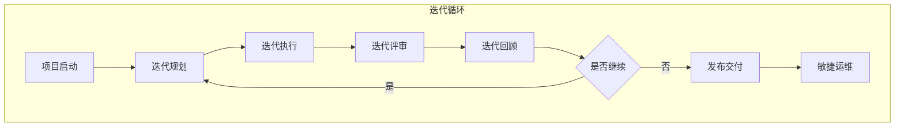

# 敏捷开发流程

## 概述

敏捷开发流程是一种以人为核心、迭代、循序渐进的开发方法。通过Scrum和Kanban两种主要框架，实现快速响应变化、持续交付价值的软件开发模式。

### Scrum框架

Scrum是一种迭代增量式开发框架，以固定时长的Sprint（通常2-4周）为周期，持续交付可用的软件增量。

**核心要素：**
- **角色**：Product Owner、Scrum Master、Development Team
- **工件**：Product Backlog、Sprint Backlog、Increment
- **活动**：Sprint Planning、Daily Scrum、Sprint Review、Sprint Retrospective

### Kanban框架

Kanban是一种可视化工作流管理方法，通过看板可视化工作项状态，限制在制品数量（WIP），实现持续交付。

**核心要素：**
- **看板**：可视化工作流程
- **WIP限制**：控制各阶段工作项数量
- **持续交付**：无固定迭代周期，按需交付

## 敏捷价值观和原则

### 敏捷宣言（Agile Manifesto）

我们通过实践探索更好的软件开发方式，并以此帮助他人。在此过程中，我们领悟到：

| 我们重视 | 同时也承认 | 更有价值的是 |
|---------|-----------|------------|
| **个体和互动** | 流程和工具 | 人是核心 |
| **工作的软件** | 详尽的文档 | 交付价值 |
| **客户合作** | 合同谈判 | 共同目标 |
| **响应变化** | 遵循计划 | 适应变化 |

### 敏捷十二原则

1. 客户满意：通过早期和持续交付有价值的软件
2. 拥抱变化：即使开发后期也欢迎需求变化
3. 频繁交付：以较短周期交付可工作的软件
4. 协作工作：业务人员和开发人员每天一起工作
5. 激励个体：为项目提供环境和支持，信任他们完成任务
6. 面对面沟通：传达信息最有效的方式是面对面交谈
7. 可工作软件：是进度的首要度量标准
8. 可持续节奏：开发人员、用户和赞助者应能保持恒定的节奏
9. 技术卓越：持续关注技术卓越和良好设计
10. 简洁为本：以最简工作量完成需要做的事情
11. 自组织团队：最好的架构、需求和设计出自自组织团队
12. 持续改进：团队定期反思如何变得更高效，并相应调整

## 敏捷流程全景图



```
┌─────────────────────────────────────────────────────────────────────────────┐
│                            敏捷开发流程全景图                                 │
├─────────────────────────────────────────────────────────────────────────────┤
│                                                                              │
│                        ┌──────────────────┐                                │
│                        │     项目启动      │                                │
│                        └────────┬─────────┘                                │
│                                 │                                            │
│                                 ▼                                            │
│  ┌────────────────────────────────────────────────────────────────────┐     │
│  │                        敏捷迭代循环                                  │     │
│  │                                                                     │     │
│  │     ┌──────────┐                         ┌──────────────────┐     │     │
│  │     │ 迭代规划  │◀─────────────────────────│   迭代回顾       │     │     │
│  │     │ Sprint   │                          │   Retrospective  │     │     │
│  │     │ Planning │                          │                  │     │     │
│  │     └────┬─────┘                          └────────▲─────────┘     │     │
│  │          │                                         │              │     │
│  │          │                                         │              │     │
│  │          ▼                                         │              │     │
│  │     ┌──────────┐                          ┌───────┴───────┐       │     │
│  │     │ 迭代执行  │                          │   迭代评审     │       │     │
│  │     │ Sprint   │─────────────────────────▶│   Review      │       │     │
│  │     │ Execution│                          │               │       │     │
│  │     └──────────┘                          └───────────────┘       │     │
│  │                                                                     │     │
│  └────────────────────────────────────────────────────────────────────┘     │
│                                 │                                            │
│                                 │ 产品Backlog完成                            │
│                                 ▼                                            │
│                        ┌──────────────────┐                                │
│                        │     发布交付      │                                │
│                        │    Release       │                                │
│                        └────────┬─────────┘                                │
│                                 │                                            │
│                                 ▼                                            │
│                        ┌──────────────────┐                                │
│                        │     敏捷运维      │                                │
│                        │   Operations     │                                │
│                        └──────────────────┘                                │
│                                                                              │
└─────────────────────────────────────────────────────────────────────────────┘
```

## 阶段导航

| 阶段 | 目录 | 核心目标 | 关键活动 | 主要产出 |
|------|------|---------|---------|---------|
| 项目启动 | [01-项目启动](01-项目启动/) | 建立敏捷基础 | 产品愿景、团队组建、环境准备 | 产品愿景、初始Backlog |
| 迭代规划 | [02-迭代规划](02-迭代规划/) | 规划迭代内容 | 需求梳理、Sprint规划会、容量评估 | Sprint Backlog |
| 迭代执行 | [03-迭代执行](03-迭代执行/) | 实现迭代目标 | 每日站会、开发任务、持续集成 | 可工作增量 |
| 迭代评审 | [04-迭代评审](04-迭代评审/) | 展示迭代成果 | 演示会议、利益相关者反馈 | 评审记录、反馈清单 |
| 迭代回顾 | [05-迭代回顾](05-迭代回顾/) | 持续改进 | 回顾会议、改进项识别、行动计划 | 改进计划 |
| 发布交付 | [06-发布交付](06-发布交付/) | 价值交付 | 发布规划、部署执行、变更沟通 | 发布版本 |
| 敏捷运维 | [07-敏捷运维](07-敏捷运维/) | 稳定运行 | 监控告警、快速响应、持续优化 | 运维报告 |

## 敏捷角色定义

### Product Owner（产品负责人）

| 职责 | 说明 |
|------|------|
| 产品愿景 | 定义产品愿景和路线图 |
| 需求管理 | 管理Product Backlog，明确需求优先级 |
| 验收决策 | 决定是否接受迭代增量 |
| 利益相关者 | 代表利益相关者需求，平衡各方期望 |
| 价值最大化 | 确保团队工作创造最大价值 |

### Scrum Master（敏捷教练）

| 职责 | 说明 |
|------|------|
| 流程引导 | 确保团队正确理解和执行Scrum |
| 障碍消除 | 识别并帮助移除团队进展的障碍 |
| 教练指导 | 指导团队成员提升敏捷能力 |
| 会议主持 | 组织和引导Scrum各项会议 |
| 持续改进 | 推动团队持续改进流程和效率 |

### Development Team（开发团队）

| 职责 | 说明 |
|------|------|
| 自组织 | 团队自主决定如何完成工作 |
| 跨职能 | 团队具备完成产品增量所需的各种技能 |
| 承诺交付 | 承诺并交付Sprint目标 |
| 质量保障 | 对交付物的质量负责 |
| 持续学习 | 不断提升技术和协作能力 |

### 角色协作关系

```
┌─────────────────────────────────────────────────────────────────────┐
│                        敏捷团队协作模型                               │
├─────────────────────────────────────────────────────────────────────┤
│                                                                      │
│                    ┌──────────────────┐                             │
│                    │   利益相关者      │                             │
│                    │  Stakeholders    │                             │
│                    └────────┬─────────┘                             │
│                             │ 需求/反馈                               │
│                             ▼                                        │
│              ┌──────────────────────────────┐                       │
│              │      Product Owner           │                       │
│              │  ┌────────────────────────┐  │                       │
│              │  │ - 产品愿景             │  │                       │
│              │  │ - Backlog管理          │  │                       │
│              │  │ - 优先级决策           │  │                       │
│              │  └────────────────────────┘  │                       │
│              └──────────────┬───────────────┘                       │
│                             │ Sprint目标                            │
│                             ▼                                        │
│  ┌─────────────────────────────────────────────────────────────┐   │
│  │                      Development Team                        │   │
│  │  ┌──────────┐  ┌──────────┐  ┌──────────┐  ┌──────────┐    │   │
│  │  │ 开发人员A │  │ 开发人员B │  │ 开发人员C │  │ 测试人员  │    │   │
│  │  └──────────┘  └──────────┘  └──────────┘  └──────────┘    │   │
│  │                                                              │   │
│  │  ┌──────────────────────────────────────────────────────┐  │   │
│  │  │              Scrum Master (服务型领导)                │  │   │
│  │  │  - 流程引导  - 障碍消除  - 教练指导  - 会议主持       │  │   │
│  │  └──────────────────────────────────────────────────────┘  │   │
│  └─────────────────────────────────────────────────────────────┘   │
│                                                                      │
└─────────────────────────────────────────────────────────────────────┘
```

## 敏捷度量体系

### 核心度量指标

| 指标 | 定义 | 用途 |
|------|------|------|
| **Velocity** | 团队一个Sprint完成的故事点数 | 预测交付能力、规划Sprint容量 |
| **Lead Time** | 从需求提出到交付上线的时间 | 评估端到端效率 |
| **Cycle Time** | 从开发开始到完成的时间 | 评估开发效率 |
| **Sprint Burndown** | Sprint内剩余工作量变化趋势 | 监控Sprint进度 |
| **Sprint Goal达成率** | 完成的Sprint目标比例 | 评估团队承诺可靠性 |
| **缺陷逃逸率** | 生产环境发现的缺陷比例 | 评估质量保障效果 |
| **团队满意度** | 团队成员对工作的满意程度 | 评估团队健康度 |

### 看板度量

| 指标 | 定义 | 用途 |
|------|------|------|
| **WIP** | 各阶段在制品数量 | 控制工作负载、发现瓶颈 |
| **Throughput** | 单位时间完成的工作项数量 | 评估产出效率 |
| **Flow Efficiency** | 有效工作时间占总时间比例 | 识别等待浪费 |

### 度量可视化

```
┌─────────────────────────────────────────────────────────────────────┐
│                        敏捷度量仪表盘                                 │
├─────────────────────────────────────────────────────────────────────┤
│                                                                      │
│  ┌──────────────────┐   ┌──────────────────┐   ┌──────────────────┐│
│  │    Velocity      │   │    Lead Time     │   │   Cycle Time     ││
│  │   ┌──────────┐   │   │   ┌──────────┐   │   │   ┌──────────┐   ││
│  │   │   34pts  │   │   │ │  12 days │   │   │   │   5 days │   ││
│  │   └──────────┘   │   │   └──────────┘   │   │   └──────────┘   ││
│  │   近4周平均       │   │   近30天平均     │   │   近30天平均     ││
│  └──────────────────┘   └──────────────────┘   └──────────────────┘│
│                                                                      │
│  ┌────────────────────────────────────────────────────────────────┐│
│  │                      Sprint Burndown                           ││
│  │  40 ┤                                                          ││
│  │     ┤ ╲                                                         ││
│  │  30 ┤  ╲                                                        ││
│  │     ┤   ╲    理想线                                             ││
│  │  20 ┤    ╲  ─ ─ ─ ─ ─ ─ ─ ─ ─ ─ ─ ─                            ││
│  │     ┤     ╲  实际线                                             ││
│  │  10 ┤      ╲ ━━━━━━━━━━━━━━━━━━━━━                            ││
│  │     ┤       ╲                                                   ││
│  │   0 ┤────────╲──────────────────────────────────────────────  ││
│  │     └──────────────────────────────────────────────────────   ││
│  │              Day1  Day3  Day5  Day7  Day9  Day10              ││
│  └────────────────────────────────────────────────────────────────┘│
│                                                                      │
└─────────────────────────────────────────────────────────────────────┘
```

## 与瀑布流程对比

| 维度 | 敏捷流程 | 瀑布流程 |
|------|---------|---------|
| **开发模式** | 迭代增量开发 | 线性顺序执行 |
| **需求管理** | 持续细化，拥抱变化 | 前期完整定义，变更成本高 |
| **交付周期** | 多次交付，周期短 | 单次交付，周期长 |
| **适用场景** | 需求不确定、需要快速验证 | 需求明确、变更少、质量要求严格 |
| **团队协作** | 跨职能团队，强调沟通 | 阶段分工明确，依赖文档 |
| **风险管理** | 持续识别，快速响应 | 前期规划，后期风险低 |
| **客户参与** | 全程持续参与 | 主要在需求阶段和验收阶段 |
| **文档要求** | 轻量文档，代码即文档 | 完整详细的文档 |
| **质量保障** | 持续测试、持续集成 | 阶段性测试、验收测试 |

### 适用场景建议

**选择敏捷流程：**
- 需求不确定或快速变化的项目
- 创新型产品开发
- 初创团队或小团队
- 需要快速验证市场反馈的项目
- 互联网产品、移动应用开发

**选择瀑布流程：**
- 需求明确且稳定的项目
- 合规性要求高的项目（如金融、医疗）
- 大型复杂系统重构项目
- 外包或固定合同项目
- 安全关键型系统（如航空、核电）

## 快速入门指南

### 1. 项目启动

- 明确产品愿景和目标
- 组建敏捷团队，确定角色
- 创建初始Product Backlog
- 配置敏捷工具（如Jira、Trello）

### 2. 开始迭代

- 执行Sprint规划会议
- 确定Sprint目标和Sprint Backlog
- 每日执行站会同步进度
- 持续开发和集成

### 3. 迭代结束

- 执行Sprint评审展示成果
- 收集利益相关者反馈
- 执行Sprint回顾识别改进
- 启动下一轮迭代

### 4. 发布交付

- 当产品增量具备发布价值时执行发布
- 按发布规划执行部署
- 监控上线后运行状态
- 收集用户反馈

### 5. 持续改进

- 根据回顾会议改进项优化流程
- 调整团队工作方式
- 提升团队敏捷能力

## 敏捷实践建议

### DoD（Definition of Done）完成定义

每个用户故事完成的标准定义：

```
┌─────────────────────────────────────────────────────────────────────┐
│                     完成定义（DoD）示例                               │
├─────────────────────────────────────────────────────────────────────┤
│                                                                      │
│  □ 代码开发完成                                                      │
│  □ 代码审查通过                                                      │
│  □ 单元测试编写并通过                                                │
│  □ 集成测试通过                                                      │
│  □ 功能测试通过                                                      │
│  □ 产品负责人验收                                                    │
│  □ 文档更新完成                                                      │
│  □ 无严重缺陷                                                        │
│  □ 部署到测试环境                                                    │
│                                                                      │
└─────────────────────────────────────────────────────────────────────┘
```

### 用户故事格式

```
作为 <角色>
我想要 <功能>
以便于 <价值>

验收标准：
- Given <前置条件>
- When <触发动作>
- Then <预期结果>
```

### 敏捷会议节奏

| 会议 | 频率 | 时长 | 参与者 | 目的 |
|------|------|------|--------|------|
| Sprint规划会 | 每Sprint开始 | 2-4小时 | 全团队 | 规划Sprint内容 |
| 每日站会 | 每天 | 15分钟 | 开发团队 | 同步进度、识别障碍 |
| Sprint评审 | 每Sprint结束 | 1-2小时 | 全团队+利益相关者 | 展示成果、获取反馈 |
| Sprint回顾 | 每Sprint结束 | 1-1.5小时 | 全团队 | 反思改进 |
| 需求梳理 | 每周1-2次 | 1小时 | PO+团队代表 | 细化Backlog |

## 相关文档

- [流程管理框架](../00-流程管理框架/README.md) - 流程治理规范、角色职责
- [跨阶段流程](../03-跨阶段流程/README.md) - 质量门控、变更管理、风险管理
- [流程仪表盘](../04-流程仪表盘/README.md) - 阶段状态、效率指标、质量趋势
- [产出物总清单](../05-产出物总清单/项目文档产出物清单.md) - 产出物定义
- [瀑布开发流程](../01-瀑布开发流程/README.md) - 瀑布流程参考