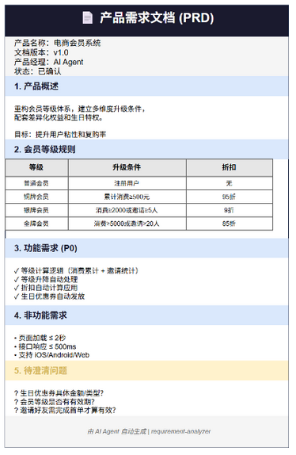
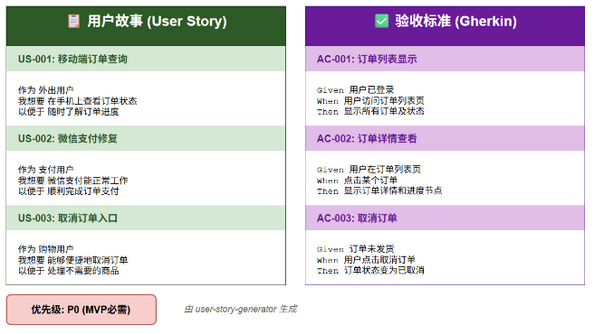
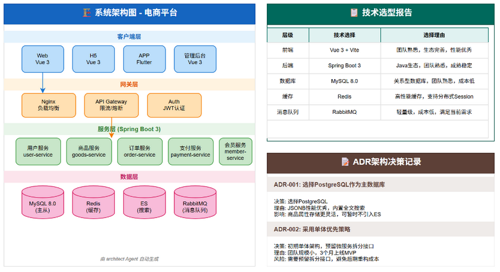
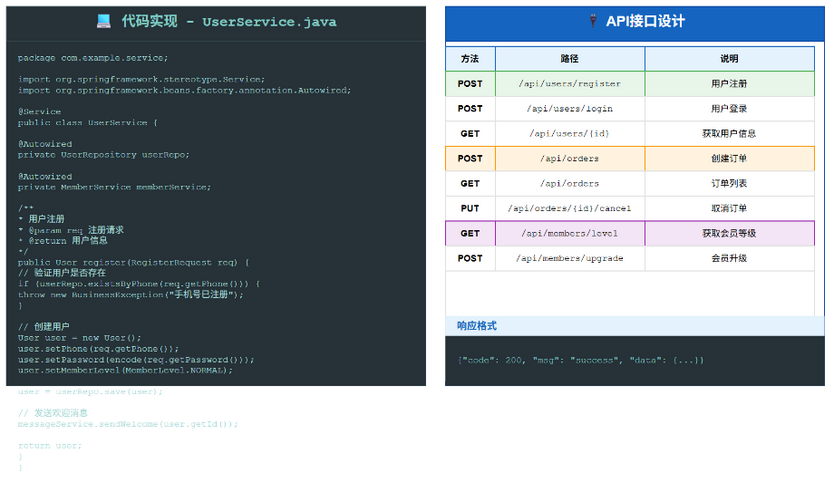
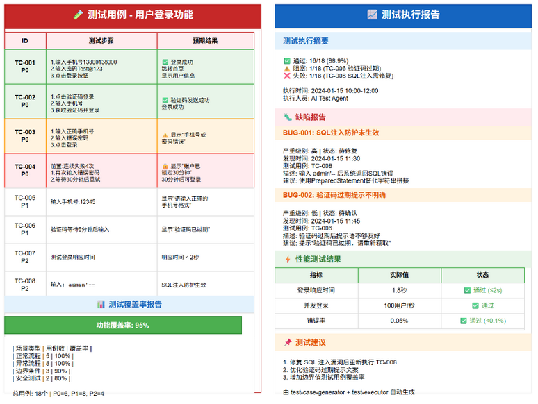
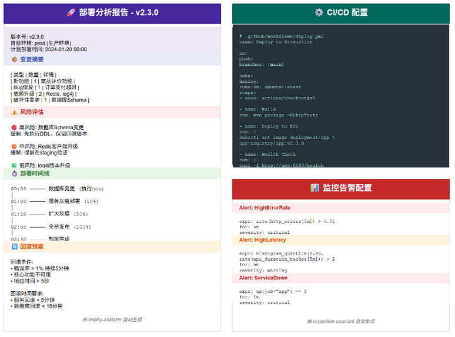

<div align="center">

# 软件开发工作流 AI.SKILL

**让 AI 成为软件开发流程中的智能伙伴，从需求到运维的全流程赋能**

[](https://github.com/cilangzzz/software-dev-ai-workflow)
[](https://github.com/cilangzzz/software-dev-ai-workflow/fork)
[](LICENSE)
[](https://claude.ai/code)
[](https://agentskills.io)

</div>

---

## 这是什么

一套 **AI 驱动的软件开发全流程框架**。它不是代码库，而是一个结构化的知识体系——定义了 AI Agent 在软件开发各角色中"该怎么干、干什么、产出什么"，帮助团队建立标准化的研发流程和文档规范。

**框架特性：**

- 🔄 **双流程支持** — 瀑布 / 敏捷全流程定义，含质量门控检查点（Gate 1-5）
- 🏭 **行业系统模型** — 内置 ERP（12 模块）、MES（10+ 模块）、语音社区等完整参考架构
- 🔧 **20+ 通用技能** — Word、Draw.io、Notion、Jira、禅道等工具集成
- 🧬 **可自扩展** — 通过 `author-agent` / `author-skill` 元技能，AI 自行创建新角色和新技能
- 📐 **质量门控** — 每阶段有可量化检查标准，不达标不放行

---

## 适用人群

| 角色 | 使用场景 | 核心产出 |
|------|----------|----------|
| **产品经理** | 快速生成PRD、用户故事、验收标准 | PRD、Gherkin验收、设计系统 |
| **架构师** | 自动输出技术选型报告、架构设计文档 | ADR、架构图、技术选型报告 |
| **开发工程师** | 基于设计方案生成代码框架、API实现 | 完整可运行代码、数据模型 |
| **测试工程师** | 自动生成测试用例、测试报告 | 测试用例、覆盖率报告（≥95%） |
| **运维工程师** | 生成部署文档、运维手册、监控配置 | CI/CD配置、部署方案、告警规则 |
| **项目经理** | 获取完整项目文档体系、进度跟踪模板 | 里程碑报告、风险登记册 |
| **创业者/独立开发者** | 从想法到可运行代码的快速验证 | MVP产品、全套文档 |
| **技术团队Leader** | 建立标准化的研发流程和文档规范 | 流程规范、质量标准 |

**覆盖 8 大角色 Agent**：产品、研发、测试、运维、安全、设计、数据、项目管理

---

## 能做什么

### 📋 产品阶段

| PRD 产品需求文档 | 用户故事 + 验收标准 |
|:---:|:---:|
|  |  |

### 🏗️ 设计阶段



### 💻 开发阶段



### 🧪 测试阶段



### 🚀 运维阶段



---

## 目录结构

```
software-dev-ai-workflow/
├── 0.0-通用skill/                    # 通用技能工具集
│   ├── author-build-project-docs/    # 项目文档生成
│   └── manage-项目管理/              # 项目管理工具
├── 1.0-软件开发流程角色agent模型/      # 角色Agent定义
├── 2.0-用例/                         # 用例示例库 ⭐
│   ├── agent用例/                    # Agent使用示例
│   ├── 工作流/                       # 端到端工作流示例
│   ├── 开发流程样例/                  # 瀑布/敏捷流程
│   ├── 系统模型样例/                  # ERP、MES、VCP
│   └── 项目管理样例/                  # 项目管理模板
├── 3.0-基础开发系统模板/              # 基础开发框架
└── output/                           # 输出目录
```

---

## 快速开始

### 使用步骤

```
1. 选择角色Agent → 从 1.0-软件开发流程角色agent模型/ 选择
2. 查看用例示例 → 进入 2.0-用例/ 查看详细示例
3. 输入需求描述 → 告诉AI你想做什么
4. 获取产出 → AI自动生成文档或代码
```

### 用例导航

| 想做什么 | 去哪里看 |
|----------|----------|
| 学习如何使用Agent | [2.0-用例/agent用例/](2.0-用例/agent用例/) |
| 了解开发流程 | [2.0-用例/开发流程样例/](2.0-用例/开发流程样例/) |
| 参考系统模型 | [2.0-用例/系统模型样例/](2.0-用例/系统模型样例/) |
| 端到端工作流示例 | [2.0-用例/工作流/](2.0-用例/工作流/) |

---

## 示例项目

| 项目 | 类型 | 说明 |
|------|------|------|
| [Miniai-Notepad](https://github.com/cilangzzz/Miniai-Notepad) | 前端应用 | 零手写代码，Vue3 + TypeScript，AI自动生成 |
| [yudao-aisk-mes](https://github.com/cilangzzz/yudao-aisk-mes) | 企业系统 | 汽车装配MES，Spring Boot + Vue3 |
| [Crosshair Pro](https://github.com/cilangzzz/Crosshair) | 桌面应用 | FPS准心工具，WPF + .NET 8 |
| [Session Manager](https://github.com/cilangzzz/session-manger) | 浏览器扩展 | 会话管理工具，AI辅助开发 |

---

## 贡献指南

欢迎贡献新的 Skill 或改进现有 Skill：

1. Fork 本仓库
2. 创建特性分支 (`git checkout -b feature/AmazingFeature`)
3. 提交更改 (`git commit -m 'Add some AmazingFeature'`)
4. 推送到分支 (`git push origin feature/AmazingFeature`)
5. 提交 Pull Request

## 许可证

[MIT License](LICENSE)

---

<div align="center">

**如果这个项目对你有帮助，请给一个 ⭐️ 支持一下！**

Made with ❤️ by [cilangzzz](https://github.com/cilangzzz)

</div>